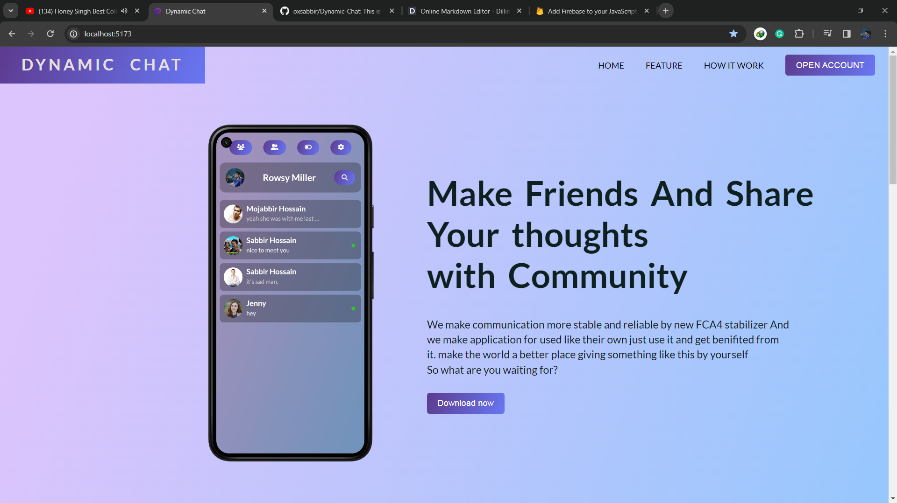
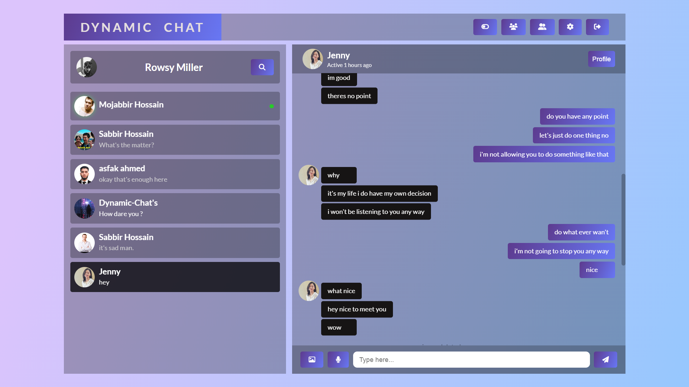

# Dynamic Chat 
## _The Last Markdown Editor, Ever_

Dynamic-chat is a cloud-hosted, mobile-ready, realtime communicationable,
React Js powered Chat Application.

- Just create an account using email
- Make Friends 
- And see the magic

# Test User
-Email : karim123@gmail.com
-Password: karim123

## Features

- Realtime communication -( Using firebase realtime database )
- Ontime recordable voice message functinality
- High quality image sharing between friends
- Block user if don't like them
- Unfriend them blocking is not enough
- Create group chat ( Group creator would be the Admin)
- Admin based user remove system
- Anybody can add their friends to the group
- User can delete their message ( Including Photo,voice)
- User can see when was last-time their friend was active

> The goal was create this application is nothing
> but for practice and gain confidence.
> altough it was challenged project 
> that's why i had to use as less tutorial and 
> resource as possible. as a developer we have to refer 
> to some documentation all the time that's fine.
> cause the tech-world so vast and wide.

## Tech

Dynamic-chat uses a number of open source projects to work properly:

   
- React-Js - HTML enhanced for web apps!
- Module-Css - For styling our apps
- Fontawesome - For good looking icons
- Firebase-Realtime-Database - For storing our users data
- Firebase-Storage - For Storing users media files
- Firebase-Authentication - For keep our authenticated and safe 
- Context-Api - For managing our application state

# User Interface preview 

## Landing Page

## Main Dashboard 

